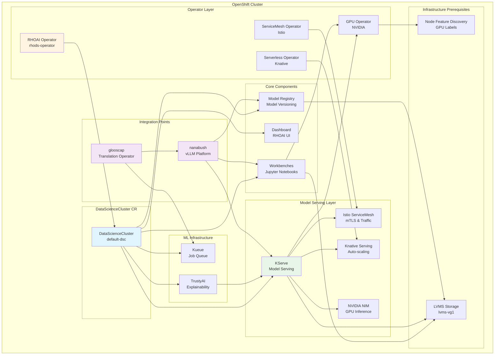

# Red Hat OpenShift AI (RHOAI) Installation Guide

**Cluster:** `api.ocp-sno-1050ti.rh.dasmlab.org:6443`  
**Date:** 2025-11-15  
**Purpose:** Step-by-step installation and documentation of RHOAI components

## What is Red Hat OpenShift AI (RHOAI)?

Red Hat OpenShift AI (formerly Red Hat OpenShift Data Science - RHODS) is a comprehensive platform for data scientists and ML engineers to build, train, and deploy AI/ML models on OpenShift.

### Key Components

RHOAI consists of several operators and components that work together:

1. **RHOAI Operator (`rhods-operator`)** - The main operator that orchestrates all RHOAI components
2. **DataScienceCluster (DSC)** - Custom Resource that defines which RHOAI components to deploy
3. **Component Operators** - Each component has its own operator (e.g., model serving, workbenches, etc.)

### Architecture Diagram

The following diagram shows the RHOAI component hierarchy and relationships:



**ASCII Text Version:**

```
┌─────────────────────────────────────────────────────────────────────────────┐
│                          OpenShift Cluster (1050Ti)                          │
├─────────────────────────────────────────────────────────────────────────────┤
│                                                                               │
│  ┌────────────────────── Operator Layer ───────────────────────┐           │
│  │  RHOAI Operator  │  ServiceMesh  │  Serverless  │  GPU     │           │
│  │  (rhods-operator)│  (Istio)      │  (Knative)   │  (NVIDIA)│           │
│  └──────────────────┴────────────────┴──────────────┴──────────┘           │
│                           │                                                  │
│                           ▼                                                  │
│  ┌─────────────────────── DataScienceCluster ───────────────────┐          │
│  │                    DataScienceCluster CR                      │          │
│  │                    (default-dsc)                              │          │
│  └───────────────────────────────────────────────────────────────┘          │
│                           │                                                  │
│        ┌──────────────────┼──────────────────┬──────────────┐              │
│        │                  │                  │              │              │
│        ▼                  ▼                  ▼              ▼              │
│  ┌──────────┐      ┌──────────┐      ┌──────────┐   ┌──────────┐         │
│  │Workbenches│      │ Dashboard│      │Model Reg │   │ KServe   │         │
│  │ (Jupyter) │      │   (UI)   │      │          │   │ (Serving)│         │
│  └────┬─────┘      └──────────┘      └────┬─────┘   └────┬─────┘         │
│       │                                    │              │                │
│       │                                    │              │                │
│       ▼                                    │              ▼                │
│  ┌─────────────────────────────────────────────────────────┐              │
│  │              Infrastructure Layer                        │              │
│  │  ┌────────┐  ┌──────────┐  ┌──────┐  ┌──────────┐     │              │
│  │  │ LVMS   │  │ Knative  │  │Istio │  │ NVIDIA   │     │              │
│  │  │ Storage│  │ Serving  │  │SM    │  │ NIM      │     │              │
│  │  └────────┘  └──────────┘  └──────┘  └──────────┘     │              │
│  └─────────────────────────────────────────────────────────┘              │
│       │                                                                    │
│       │                                                                    │
│       ▼                                                                    │
│  ┌─────────────────────────────────────────────────────────┐              │
│  │          Integration Points (nanabush/glooscap)          │              │
│  │  ┌───────────┐                                          │              │
│  │  │ nanabush  │ ◄──────────────────┐                     │              │
│  │  │ (vLLM)    │                    │                     │              │
│  │  └─────┬─────┘                    │                     │              │
│  │        │                           │                     │              │
│  │        │                           │                     │              │
│  │        ▼                           │                     │              │
│  │  ┌───────────┐                     │                     │              │
│  │  │ glooscap  │                     │                     │              │
│  │  │(Translation│                     │                     │              │
│  │  └───────────┘                     │                     │              │
│  └─────────────────────────────────────────────────────────┘              │
│                                                                             │
└─────────────────────────────────────────────────────────────────────────────┘

Component Relationships:
├─ RHOAI Operator manages DataScienceCluster CR
├─ DataScienceCluster defines component states (Managed/Removed/Unmanaged)
├─ Component Operators deploy and manage their components
├─ KServe depends on: ServiceMesh Operator + Serverless Operator
├─ TrustyAI depends on: KServe (InferenceServices CRD)
├─ Workbenches + KServe use: GPU Operator + LVMS Storage
└─ nanabush/glooscap integrate with: Workbenches, KServe, Model Registry
```

### RHOAI Components Explained

RHOAI includes many components. Here's what each one does:

**Core Components:**
- **workbenches** - Data Science Workbenches (Jupyter Notebooks) - Interactive development environments where data scientists can develop, train, and test models
- **dashboard** - Central UI dashboard for managing AI/ML workloads, workbenches, and models
- **modelregistry** - Model registry to store, version, and track ML models

**Model Serving:**
- **kserve** - KServe for model serving (replaces deprecated Seldon) - High-performance model serving framework
  - **serving** - Knative-based serving infrastructure
  - **nim** - NVIDIA Inference Microservices - Optimized inference serving
- **modelmeshserving** - Model Mesh for multi-framework model serving (legacy, can be replaced by KServe)

**ML Infrastructure:**
- **datasciencepipelines** - Kubeflow Pipelines - Build and run ML pipelines/workflows
- **trainingoperator** - Training Operator - For distributed training jobs (PyTorch, TensorFlow, etc.)
- **codeflare** - CodeFlare - Multi-cluster job scheduling and resource management
- **ray** - Ray - Distributed computing framework for ML workloads
- **kueue** - Kueue - Job queue management for ML workloads

**AI/ML Features:**
- **trustyai** - TrustyAI - Explainability and bias detection for ML models

**Removed/Deprecated (in default config):**
- **feastoperator** - Feast feature store (removed in default config)
- **llamastackoperator** - LLamaStack operator (removed in default config)

**Note:** For a single-node cluster with limited resources, we might want to enable only essential components to start with.

## Prerequisites

Before installing RHOAI, ensure:

- ✅ **OpenShift 4.20.2** - Compatible version
- ✅ **GPU Support** - NVIDIA GPU Operator installed and working
- ✅ **Storage** - Storage class available (we have `lvms-vg1`)
- ✅ **Operator Catalog** - `redhat-operators` catalog accessible
- ✅ **Node Resources** - Sufficient CPU/memory for RHOAI components

## Installation Steps

We'll install RHOAI in these steps:

1. **Install RHOAI Operator** - Subscribe to `rhods-operator` from `redhat-operators`
2. **Create DataScienceCluster** - Configure which components to deploy
3. **Verify Components** - Check each component deployment
4. **Test GPU Access** - Verify GPU workloads can run

---

## Step 1: Install RHOAI Operator

### Understanding What We're Doing

We're installing the main RHOAI operator which will:
- Manage the lifecycle of RHOAI components
- Watch for DataScienceCluster custom resources
- Deploy and coordinate component operators

### Implementation

#### Step 1.1: Create Namespaces

**What we're doing:** RHOAI needs dedicated namespaces for its components. We create:
- `redhat-ods-operator` - Main namespace for the RHOAI operator
- `redhat-ods-monitoring` - Namespace for monitoring components (Prometheus, Grafana, etc.)

**Why:** Namespace isolation helps with:
- Resource management
- Security boundaries
- Role-based access control (RBAC)
- Clean organization of components

```bash
oc create namespace redhat-ods-operator
oc create namespace redhat-ods-monitoring
```

#### Step 1.2: Create OperatorGroup

**What we're doing:** OperatorGroup tells OLM which namespace(s) this operator should manage.

**Why:** OLM needs to know where to install operator resources and what namespaces to watch.

```yaml
apiVersion: operators.coreos.com/v1
kind: OperatorGroup
metadata:
  name: redhat-ods-operator-group
  namespace: redhat-ods-operator
spec:
  targetNamespaces:
  - redhat-ods-operator
```

**What this means:**
- `spec.targetNamespaces` - List of namespaces this operator will manage (if specified)
- **IMPORTANT:** RHOAI operator ONLY supports `AllNamespaces` install mode
  - It needs to watch cluster-wide resources (DataScienceCluster CRs can be in any namespace)
  - It deploys components to multiple namespaces (redhat-ods-applications, redhat-ods-monitoring, etc.)
  - For AllNamespaces mode, we set `spec: {}` (empty - no targetNamespaces)

**Why AllNamespaces?**
- RHOAI components (workbenches, serving, etc.) can be deployed to different namespaces
- Users can create DataScienceCluster resources in their own namespaces
- The operator needs cluster-wide visibility to manage all RHOAI resources

#### Step 1.3: Create Subscription

**What we're doing:** Subscription tells OLM to install the `rhods-operator` from the `redhat-operators` catalog.

**Why:** This is how we request an operator to be installed. OLM will:
1. Find the operator package in the catalog
2. Create an InstallPlan
3. Install the operator CSV (ClusterServiceVersion)
4. Deploy the operator pods

```yaml
apiVersion: operators.coreos.com/v1alpha1
kind: Subscription
metadata:
  name: rhods-operator
  namespace: redhat-ods-operator
spec:
  channel: stable          # Update channel (stable, fast, alpha, etc.)
  name: rhods-operator     # Package name in catalog
  source: redhat-operators # Catalog source name
  sourceNamespace: openshift-marketplace
  installPlanApproval: Automatic  # Auto-approve install plans
```

**What each field means:**
- `channel: stable` - Use the stable channel (vs fast/alpha for newer features)
- `installPlanApproval: Automatic` - Auto-approve install plans (vs Manual for review)

**NOTE:** RHOAI operator requires `AllNamespaces` install mode - it needs to watch cluster-wide resources. We need to update the OperatorGroup accordingly.

#### Step 1.4: Verify Installation

**What we're checking:** After creating the subscription, OLM will:
1. Create an InstallPlan (approved automatically)
2. Install the operator CSV (ClusterServiceVersion)
3. Deploy CRDs (Custom Resource Definitions) cluster-wide
4. Deploy operator pods

**Verification:**
```bash
# Check if DataScienceCluster CRD is available (indicates operator is installed)
oc api-resources | grep datasciencecluster

# Check subscription status
oc get subscription rhods-operator -n redhat-ods-operator

# Verify CRDs are available
oc get crd | grep opendatahub.io
```

**Current Status:** ✅ RHOAI operator installed and CRDs available on 1050Ti cluster.

---

## Understanding DataScienceCluster (DSC)

### What is a DataScienceCluster?

**DataScienceCluster (DSC)** is the **primary Custom Resource (CR)** that defines which RHOAI components to deploy and how to configure them. Think of it as a "manifest" or "blueprint" that tells the RHOAI operator: *"Here's what I want installed and how I want it configured."*

### Key Concepts

#### 1. **DSC as a Declarative Configuration**

**What this means:**
- You declare the desired state (what components you want)
- The operator makes it so (reconciles to that state)
- You don't tell it HOW to install - you just say WHAT you want

**Example:**
```yaml
spec:
  components:
    workbenches:
      managementState: Managed  # "I want workbenches installed"
```

The operator sees this and:
- Installs the workbenches operator
- Creates necessary resources (deployments, services, etc.)
- Configures the component according to defaults or your overrides

#### 2. **Component Management States**

Each component can have three management states:

- **`Managed`** - Operator actively manages this component
  - Component is installed and running
  - Operator watches for changes and reconciles
  - You can customize configuration
  
- **`Removed`** - Component should not be installed
  - If previously installed, operator will remove it
  - Used to disable components you don't need
  - Saves resources on single-node clusters

- **`Unmanaged`** - Operator installed it but doesn't manage it anymore
  - Component exists but operator ignores it
  - You manage it manually
  - Rarely used in practice

**Why this matters:**
For a single-node cluster with limited resources (like our 1050Ti), we should set most components to `Removed` and only enable essential ones.

#### 3. **Component Architecture**

Each component in a DSC is actually its own operator or sub-operator:

```
DataScienceCluster (DSC)
  └── spec.components
      ├── workbenches → Workbenches Operator → Deploys Jupyter instances
      ├── dashboard → Dashboard Operator → Deploys RHOAI UI
      ├── kserve → KServe Operator → Deploys model serving infrastructure
      ├── datasciencepipelines → Pipelines Operator → Deploys Kubeflow Pipelines
      └── ... (many more)
```

**What happens when you set a component to `Managed`:**
1. RHOAI operator detects the component request
2. Checks if the component operator is installed (if not, installs it)
3. Creates component-specific Custom Resources (e.g., `Workbenches` CR)
4. Component operator reconciles and deploys pods, services, etc.

#### 4. **Namespace Strategy**

RHOAI components can be deployed to different namespaces:

- **`redhat-ods-applications`** - Main namespace for user-facing components (workbenches, dashboard)
- **`redhat-ods-monitoring`** - Monitoring components (Prometheus, Grafana)
- **`<user-namespaces>`** - User-created workbenches and models
- Component-specific namespaces created by operators

**How DSC controls this:**
- Some components have namespace configuration in their spec
- Operators create namespaces as needed
- You can override defaults through DSC configuration

#### 5. **DSC vs Individual Component CRs**

**DataScienceCluster (DSC)** - Top-level, controls all components:
```yaml
apiVersion: datasciencecluster.opendatahub.io/v1
kind: DataScienceCluster
spec:
  components:
    workbenches:
      managementState: Managed
```

**Individual Component CRs** - Created automatically by operators:
```yaml
apiVersion: datascienceplatform.opendatahub.io/v1alpha1
kind: Workbenches  # Created automatically when DSC says Managed
spec:
  ...
```

**You typically only create/manage the DSC**, not individual component CRs.

#### 6. **DSCInitialization (DSCInit) - Optional Pre-requisite**

**DSCInitialization** is an optional resource that sets up:
- Monitoring stack configuration
- Storage configuration
- Service mesh configuration
- Other infrastructure prerequisites

**When do you need it?**
- If you want custom monitoring configuration
- If you need specific storage classes
- If you want to integrate with Service Mesh
- For most basic deployments, you can skip it

**For our 1050Ti cluster:**
We can create a DSC without DSCInitialization - the operator will use defaults.

### DSC Components Explained (Detailed)

Let's break down what each component does when set to `Managed`:

#### **workbenches** - Data Science Workbenches (Jupyter)
- **What it does:** Deploys Jupyter Notebook/Lab servers for interactive development
- **What you get:** Web-based notebook interface where data scientists can:
  - Write and run Python/Julia/R code
  - Visualize data
  - Train models
  - Test inference
- **Namespace:** `redhat-ods-applications` + user-created namespaces
- **Resource usage:** Medium-High (runs persistent pods)
- **For 1050Ti:** ✅ Essential if you want to develop/test models

#### **dashboard** - RHOAI Dashboard UI
- **What it does:** Central web UI for managing RHOAI
- **What you get:** 
  - Create/manage workbenches
  - View model serving endpoints
  - Monitor resources
  - Access to all RHOAI features via web
- **Namespace:** `redhat-ods-applications`
- **Resource usage:** Low-Medium
- **For 1050Ti:** ✅ Essential for easy management

#### **kserve** - Model Serving Framework
- **What it does:** Deploys KServe (formerly KFServing) for model serving
- **Components:**
  - **serving** - Knative-based serving infrastructure
  - **nim** - NVIDIA Inference Microservices (optimized for GPUs)
- **What you get:**
  - REST/gRPC endpoints for model inference
  - Auto-scaling based on traffic
  - Canary/AB testing
  - Multi-framework support (PyTorch, TensorFlow, ONNX, etc.)
- **Namespace:** `redhat-ods-applications`, creates `knative-serving`
- **Resource usage:** Medium (only uses resources when serving models)
- **For 1050Ti:** ✅ Essential for deploying models

#### **modelregistry** - Model Registry
- **What it does:** Stores metadata about models (versions, lineage, metrics)
- **What you get:**
  - Versioned model storage
  - Model metadata tracking
  - Model comparison
- **Namespace:** `redhat-ods-applications` or custom
- **Resource usage:** Low
- **For 1050Ti:** ✅ Useful for model management

#### **datasciencepipelines** - Kubeflow Pipelines
- **What it does:** ML workflow orchestration (build pipelines for training, data processing, etc.)
- **What you get:**
  - Visual pipeline builder
  - Reusable pipeline components
  - Pipeline scheduling
- **Namespace:** `redhat-ods-applications`
- **Resource usage:** Medium-High
- **For 1050Ti:** ⚠️ Optional - useful for complex workflows

#### **trainingoperator** - Training Operator
- **What it does:** Distributed training for PyTorch, TensorFlow, MXNet
- **What you get:**
  - Multi-node training jobs
  - GPU-aware scheduling
  - Training job management
- **Resource usage:** High (only when running training jobs)
- **For 1050Ti:** ⚠️ Optional - single-node limits distributed training benefits

#### **codeflare** - CodeFlare
- **What it does:** Multi-cluster job scheduling and resource management
- **Resource usage:** Medium
- **For 1050Ti:** ❌ Not needed for single-node

#### **ray** - Ray Framework
- **What it does:** Distributed computing framework for ML
- **Resource usage:** Medium-High
- **For 1050Ti:** ⚠️ Optional - can be useful for parallel processing

#### **kueue** - Job Queue
- **What it does:** Kubernetes-native job queue management
- **Resource usage:** Low
- **For 1050Ti:** ✅ Useful for managing ML jobs

#### **trustyai** - TrustyAI
- **What it does:** Explainability and bias detection for ML models
- **Resource usage:** Low-Medium
- **For 1050Ti:** ✅ Useful for model explainability

#### **modelmeshserving** - Model Mesh (Legacy)
- **What it does:** Alternative to KServe (older serving framework)
- **Resource usage:** Medium
- **For 1050Ti:** ❌ Use KServe instead

### Recommended Minimal DSC for 1050Ti Cluster

For a single-node cluster with limited resources, we should enable:
- ✅ **workbenches** - For developing/testing models
- ✅ **dashboard** - For managing RHOAI
- ✅ **kserve** - For serving models (with GPU support via NIM)
- ✅ **modelregistry** - For model versioning
- ✅ **kueue** - For job management

And disable/remove:
- ❌ **datasciencepipelines** - Too resource-intensive
- ❌ **trainingoperator** - Limited benefit on single-node
- ❌ **codeflare** - Not needed for single-node
- ❌ **ray** - Optional, skip for minimal setup
- ❌ **modelmeshserving** - Use KServe instead
- ❌ **trustyai** - Can enable later if needed

---

## Step 2: Create DataScienceCluster

Now that we understand what a DSC is, let's create one tailored for our 1050Ti cluster and nanabush/glooscap integration.

### Understanding What We're Doing

**Design considerations for nanabush/glooscap:**

From the nanabush and glooscap projects, we need:
- **GPU-enabled inference endpoints** (vLLM integration)
- **Model serving infrastructure** (KServe with NIM for GPU optimization)
- **Workbenches** for model development and testing
- **Model registry** for versioning translation models
- **Job management** (Kueue) for translation job queues
- **Secure, isolated execution** (workbenches with GPU access)

**Components we'll enable:**
- ✅ **workbenches** - For developing/testing translation models
- ✅ **dashboard** - For managing RHOAI components
- ✅ **kserve** - For serving models (GPU support via NIM) - **Critical for vLLM**
- ✅ **nim** - NVIDIA Inference Microservices - **Essential for GPU inference**
- ✅ **modelregistry** - For model versioning
- ✅ **kueue** - For managing translation job queues
- ✅ **trustyai** - For model explainability (useful for translation validation)

**Components we'll disable:**
- ❌ **datasciencepipelines** - Too resource-intensive for single-node
- ❌ **trainingoperator** - Limited benefit on single-node
- ❌ **codeflare** - Not needed for single-node
- ❌ **ray** - Optional, skip for minimal setup
- ❌ **modelmeshserving** - Use KServe instead

### Implementation

#### Step 2.1: Create DataScienceCluster Resource

**What we're creating:** A DataScienceCluster CR that defines which RHOAI components to deploy.

**Why this configuration:**
- **kserve + nim** - Provides GPU-optimized model serving infrastructure for vLLM
- **workbenches** - Allows development/testing of translation models
- **modelregistry** - Tracks model versions for translation pipeline
- **kueue** - Manages job queues for glooscap translation workflows
- Minimal footprint for single-node cluster (1050Ti with limited resources)

**File:** `infra/openshift/manifests/datasciencecluster-1050ti.yaml`

**Create the DSC:**
```bash
CONTEXT="default/api-ocp-sno-1050ti-rh-dasmlab-org:6443/dasm"
oc --context=$CONTEXT apply -f infra/openshift/manifests/datasciencecluster-1050ti.yaml
```

**What happens after creation:**
1. RHOAI operator detects the DataScienceCluster resource
2. For each component with `managementState: Managed`, it:
   - Checks if the component operator is installed (if not, installs it via OLM)
   - Creates component-specific Custom Resources (e.g., `Workbenches` CR, `KServe` CR)
   - Component operators reconcile and deploy pods, services, etc.
3. Components start deploying in `redhat-ods-applications` namespace
4. Dashboard becomes available for managing workbenches

**Verification:**
```bash
# Check DSC status
CONTEXT="default/api-ocp-sno-1050ti-rh-dasmlab-org:6443/dasm"
oc --context=$CONTEXT get datasciencecluster default-dsc

# Check component pods (will appear in redhat-ods-applications)
oc --context=$CONTEXT get pods -n redhat-ods-applications

# Check component operators being installed
oc --context=$CONTEXT get csv -A | grep -E "workbenches|kserve|dashboard"

# Check component CRs being created
oc --context=$CONTEXT get workbenches -A
oc --context=$CONTEXT get kserve -A 2>&1 | head -5
```

**Expected namespaces created:**
- `redhat-ods-applications` - Main namespace for workbenches, dashboard, serving
- `knative-serving` - Created by KServe for serving infrastructure
- `rhoai-model-registries` - Model registry namespace
- `rhods-notebooks` - Workbench namespace (if configured)

#### Step 2.2: Monitor Component Deployment

**What we're monitoring:** Component operators installing and deploying their resources.

**Timeline:** Component installation can take 10-30 minutes depending on:
- Component operator installation time
- Image pull times
- Resource availability on single-node cluster

**Key components to verify:**
1. **Dashboard** - Should appear first (lightweight)
2. **Kueue** - Job queue management (needed for workflows)
3. **Model Registry** - Model versioning infrastructure
4. **KServe + NIM** - Model serving infrastructure (critical for vLLM)
5. **Workbenches** - Jupyter environments (heavier, may take longer)

**Monitoring commands:**
```bash
CONTEXT="default/api-ocp-sno-1050ti-rh-dasmlab-org:6443/dasm"

# Watch component deployments
oc --context=$CONTEXT get pods -n redhat-ods-applications -w

# Check component operator CSVs
oc --context=$CONTEXT get csv -A | grep -E "workbenches|kserve|dashboard|kueue|trustyai|modelregistry"

# Check DataScienceCluster conditions
oc --context=$CONTEXT describe datasciencecluster default-dsc | grep -A 10 "Conditions:"
```

**Current Status:** ✅ DataScienceCluster created successfully on 1050Ti cluster.

The RHOAI operator is now:
1. Installing component operators via OLM (workbenches, kserve, dashboard, etc.)
2. Creating component-specific Custom Resources
3. Deploying components to `redhat-ods-applications` namespace (will be created)
4. Setting up KServe serving infrastructure in `knative-serving` namespace

**Next steps:**
- Wait for component operators to install (10-30 minutes)
- Verify component pods are running
- Access dashboard to create workbenches
- Configure GPU-enabled workbenches for vLLM development

---

## Step 3: Verify Component Deployment

Once components start deploying, we need to verify they're working correctly, especially GPU support.

### Understanding What We're Verifying

**Critical components for nanabush/glooscap:**
1. **KServe + NIM** - Model serving infrastructure with GPU support
2. **Workbenches** - Jupyter environments with GPU access
3. **Dashboard** - Web UI for managing RHOAI
4. **Model Registry** - For model versioning
5. **Kueue** - For job management

### Implementation

We'll verify:
- Component operators are installed (CSVs succeeded)
- Component pods are running
- GPU resources are accessible from workbenches
- Model serving endpoints are available

### Current Status

**RHOAI Operator:** ✅ Running
- CSV: Succeeded
- Pods: 3/3 Running

**DataScienceCluster:** ✅ Being Processed
- Status: ProvisioningSucceeded ✅
- ComponentsReady: ⚠️ False (components still installing)
- Component CRs Created: ✅ Workbenches, KServe, etc.

**Namespaces Created:** ✅
- `redhat-ods-applications` - Active
- `rhoai-model-registries` - Active

**Component Status:**
- Workbenches: CR created, installing
- KServe: CR created, has error (needs investigation)
- Dashboard: Installing
- Model Registry: Installing
- Kueue: Installing
- TrustyAI: Waiting for KServe (dependency)

**Known Issues:**
- ⚠️ **KServe requires prerequisites:**
  - ServiceMesh operator (Istio) - **NOT installed**
  - Serverless operator (Knative) - **NOT installed**
  - These must be installed before KServe can work
- TrustyAI requires KServe to be fully installed first (will resolve after KServe is fixed)

### Prerequisites for KServe

**KServe requires two operators to be installed first:**
1. **ServiceMesh Operator (Istio)** - Provides service mesh for mTLS and traffic management
2. **Serverless Operator (Knative)** - Provides Knative Serving infrastructure for KServe

**Why these are needed:**
- KServe uses Knative Serving for auto-scaling and traffic management
- ServiceMesh provides mTLS and secure communication between services
- Both are required for production-grade model serving

**For nanabush/glooscap:**
- ServiceMesh is mentioned in security requirements (mTLS, zero-exfil guardrails)
- Serverless/Knative is needed for KServe model serving endpoints
- These align with the architecture goals

Let's install these prerequisites:

#### Step 3.1: Install ServiceMesh Operator

**What we're doing:** Installing ServiceMesh operator (Istio) which provides:
- Service mesh infrastructure (mTLS, traffic management)
- Zero-trust networking policies
- Secure communication between services

**Why this is needed:**
- KServe requires ServiceMesh for mTLS and secure serving
- Aligns with nanabush/glooscap security requirements (zero-exfil guardrails)

**Installation:**
```bash
CONTEXT="default/api-ocp-sno-1050ti-rh-dasmlab-org:6443/dasm"
oc --context=$CONTEXT apply -f infra/openshift/manifests/servicemesh-operator-subscription.yaml
```

**Namespace:** `openshift-operators` (standard namespace for cluster-wide operators)

#### Step 3.2: Install Serverless Operator

**What we're doing:** Installing Serverless operator (Knative) which provides:
- Knative Serving infrastructure
- Auto-scaling capabilities
- Traffic management for serverless workloads

**Why this is needed:**
- KServe uses Knative Serving for model serving endpoints
- Provides auto-scaling based on inference traffic
- Essential for production model serving

**Installation:**
```bash
CONTEXT="default/api-ocp-sno-1050ti-rh-dasmlab-org:6443/dasm"
oc --context=$CONTEXT apply -f infra/openshift/manifests/serverless-operator-subscription.yaml
```

**Namespace:** `openshift-operators` (standard namespace for cluster-wide operators)

#### Step 3.3: Wait for Prerequisites and Verify KServe

**What we're waiting for:**
- ServiceMesh operator to install (CSV Succeeded)
- Serverless operator to install (CSV Succeeded)
- ServiceMesh control plane to deploy (istio-system namespace)
- Knative Serving to deploy (knative-serving namespace)

**After prerequisites are ready:**
- KServe should automatically retry and succeed
- KServe will create Knative Serving infrastructure
- TrustyAI will then be able to install (depends on KServe)

**Verification:**
```bash
CONTEXT="default/api-ocp-sno-1050ti-rh-dasmlab-org:6443/dasm"
# Check ServiceMesh operator
oc --context=$CONTEXT get csv -n openshift-operators | grep servicemesh

# Check Serverless operator  
oc --context=$CONTEXT get csv -n openshift-operators | grep serverless

# Once both succeed, KServe should auto-retry
oc --context=$CONTEXT get kserve default-kserve
```

**Note:** Operator installation can take 10-30 minutes. Check subscription status for InstallPlan creation.

## Installation Summary

### Component Status (1050Ti Cluster)

**Core Components:**
- ✅ **Workbenches**: Ready - Jupyter workbenches available for model development
- ⚠️ **Dashboard**: Partially Ready (1/2 pods) - UI available, second pod pending due to CPU constraints
- ✅ **Model Registry**: Ready - Model versioning available

**Model Serving:**
- ✅ **KServe**: Ready - Model serving infrastructure operational
- ✅ **Knative Serving**: Ready - Auto-scaling serving layer
- ✅ **NVIDIA NIM**: Ready - GPU-optimized inference
- ✅ **ServiceMesh (Istio)**: Ready - mTLS and traffic management

**ML Infrastructure:**
- ⚠️ **Kueue**: Pending - Insufficient CPU on single-node cluster (non-critical)
- ✅ **TrustyAI**: Ready - Model explainability available

**Prerequisites:**
- ✅ **ServiceMesh Operator**: Installed
- ✅ **Serverless Operator**: Installed
- ✅ **GPU Operator**: Installed (NVIDIA drivers, CUDA 13.0)
- ✅ **LVMS Storage**: Ready (`lvms-vg1` storage class)

### Installation Notes

1. **Single-Node Constraints**: The 1050Ti cluster has CPU constraints that prevent all components from scheduling simultaneously. The key components (Workbenches, KServe, Model Registry) are fully operational.

2. **Dashboard**: One dashboard pod is running and functional. The second pod cannot schedule due to CPU limits but is not required for operation.

3. **Kueue**: Cannot schedule due to CPU constraints. For single-node development, this is acceptable. Jobs can be managed directly via OpenShift/Kubernetes native resources.

4. **Resource Monitoring**: Monitor node resources with `oc top node` and adjust component requests if needed for your workload patterns.

### Verification Commands

```bash
CONTEXT="default/api-ocp-sno-1050ti-rh-dasmlab-org:6443/dasm"

# Check overall DataScienceCluster status
oc --context=$CONTEXT get datasciencecluster default-dsc

# Check individual component status
oc --context=$CONTEXT get workbenches,kserve,modelregistry,trustyai

# Check operator pods
oc --context=$CONTEXT get pods -n redhat-ods-operator
oc --context=$CONTEXT get pods -n redhat-ods-applications

# Check prerequisites
oc --context=$CONTEXT get csv -n openshift-operators | grep -E "servicemesh|serverless"
oc --context=$CONTEXT get csv -n nvidia-gpu-operator

# Check namespaces
oc --context=$CONTEXT get namespace | grep -E "redhat-ods|knative|istio|rhoai"

# Check GPU availability
oc --context=$CONTEXT get node -l feature.node.kubernetes.io/pci-10de.present=true
```

### Dashboard Access

The RHOAI Dashboard is available at:
- **URL**: `https://rhods-dashboard-redhat-ods-applications.apps.ocp-sno-1050ti.rh.dasmlab.org`
- **Status**: 1/2 pods running (functional)
- **Note**: Second pod pending due to CPU constraints (not required for operation)

### Next Steps

1. **Access Dashboard**: Visit the dashboard URL above to access the RHOAI UI
2. **Create Workbench**: Create a GPU-enabled Jupyter workbench for model development
   - Use the dashboard UI or create a Notebook CR with GPU resource requests
   - Verify GPU allocation with `nvidia-smi` in the workbench
3. **Test GPU Access**: Verify GPU allocation in workbenches
   - Check GPU device plugin: `oc get pods -n nvidia-gpu-operator`
   - Test GPU allocation: Request GPU resources in a workbench pod
4. **Deploy Test Model**: Use KServe to deploy a test model and verify serving
   - Create an InferenceService CR for model serving
   - Test inference endpoint with curl or Python client
5. **Integrate with nanabush**: Configure vLLM endpoints using KServe
   - Deploy vLLM models via KServe InferenceService
   - Configure nanabush to use KServe endpoints
   - Update glooscap to dispatch translation jobs via KServe

